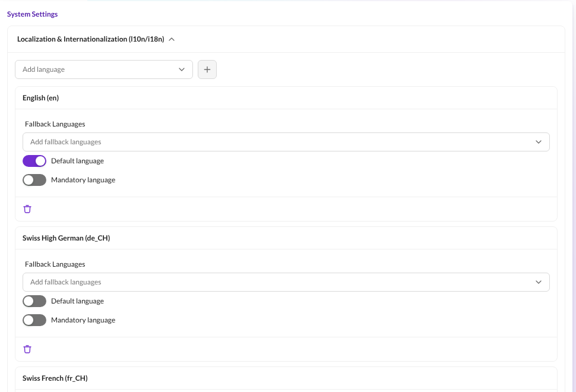
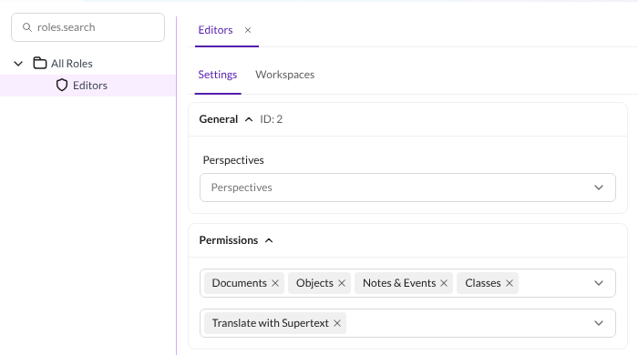

# Installation guide — Supertext Translation for Pimcore

For administrators and developers who install and set up the bundle. Editors find their part in the [user guide](USER_GUIDE.md).

## Requirements

- Pimcore 2026.1 or later with **Pimcore Studio** (`pimcore/studio-backend-bundle` and `pimcore/studio-ui-bundle`; tested with Pimcore 2026.3). The classic admin interface (`admin-ui-classic-bundle`) is not supported.
- PHP 8.4 or later
- At least two languages in Pimcore's system settings (see [Languages](#languages))
- A Supertext account with an API key: [create an account or log in](https://www.supertext.com/person/en/account/signin), then [generate the key](https://www.supertext.com/en/integrations/api) (see [API key](#api-key))
- The server must reach `https://api.supertext.com` over HTTPS

## Install

```bash
composer config repositories.supertext vcs https://github.com/Supertext/Pimcore-Supertext-Translation
composer require supertext/pimcore-supertext-translation:dev-main
```

(Publishing to Packagist is planned; then the first line is no longer needed.)

Register the bundle in `config/bundles.php`:

```php
Supertext\PimcoreTranslationBundle\SupertextTranslationBundle::class => ['all' => true],
```

Then install it and publish its Studio files:

```bash
bin/console pimcore:bundle:install SupertextTranslationBundle
bin/console assets:install public
bin/console cache:clear
```

`pimcore:bundle:install` adds the permission **Translate with Supertext** (`supertext_translate`). The bundle adds:

- a **Translate with Supertext** button to the bottom toolbar of documents (pages, snippets, e-mails…; not folders and links) and data objects (not folders) in Pimcore Studio, for users with that permission,
- the console commands `supertext:translate` and `supertext:check`.

### Update

```bash
composer update supertext/pimcore-supertext-translation
bin/console assets:install public
bin/console cache:clear
```

See [CHANGELOG.md](../CHANGELOG.md).

### Uninstall

```bash
bin/console pimcore:bundle:uninstall SupertextTranslationBundle
composer remove supertext/pimcore-supertext-translation
```

and remove the line from `config/bundles.php`. Uninstalling removes the permission. Translations already made are normal documents, object values and versions and stay; so do the notes of type `supertext` that record each translation.

## API key

1. **Supertext account.** No Supertext account yet? [Log in or create a Supertext account](https://www.supertext.com/person/en/account/signin) with your e-mail address.
2. **Generate the key** at [supertext.com → Integrations → API](https://www.supertext.com/en/integrations/api). This requires the **Admin** role in your Supertext account; ask your Supertext account's administrator otherwise.

Set the key as an environment variable, e.g. in `.env.local` or in your hosting's settings:

```bash
SUPERTEXT_API_KEY="your-key"
```

The key may be pasted with or without the `Supertext-Auth-Key ` prefix Supertext shows. Check it (free of charge, nothing is translated):

```bash
bin/console supertext:check
```

```
Supertext Translation for Pimcore 0.1.0 (https://github.com/Supertext/Pimcore-Supertext-Translation/releases/tag/v0.1.0)
API address: https://api.supertext.com/v1/
Connected. The API key works.
```

The first line is the installed version of the bundle.

Without a key, the translate dialog tells editors that Supertext is not set up yet and shows the two links above; `supertext:check` and the error messages for a rejected key show them too.

## Languages

The bundle translates into the languages set up in Pimcore: **System Settings → Localization & Internationalization (l10n/i18n)**.



- **Data objects:** every language here can be translated into, for the class's localized fields.
- **Documents:** Pimcore keeps one document tree per language, linked as translations. A document's language is its **Language** property (set it on the root page of each language tree; child pages inherit it). Documents without one count as the first language in the list. A new translation is created under the parent page's translation in the target language, so translate the language's root page first (e.g. `/en` into `/de-ch`). Pages directly under *Home* get the target language's code as key (`de-ch`); others get a key made from the translated navigation name or title (`schweizer-schokolade`).

Pimcore's language codes are sent to Supertext as BCP 47 codes: `de_CH` → `de-CH`, `fr` → `fr`. Override the code or set the form of address per language in the bundle configuration (see [Settings](#settings)).

## Permissions

In **System → User & Roles**, give editors' roles (or users):

- the permission **Translate with Supertext**,
- **Documents** and/or **Objects**, and workspaces that let them view the source and save (documents: also create) in the target location,
- for data objects in Pimcore Studio 2026.3 also **Classes**: Studio only opens data objects for users with this permission.



The dialog shows languages the user may not edit as *Not allowed*: for data objects, the workspace's *Edit* language restrictions (`lEdit`) apply; for documents, the user needs *Save* on an existing translation or *Create* on the parent page's translation. Administrators may do everything.

## Settings

| Setting | Where | Default | Meaning |
| --- | --- | --- | --- |
| `SUPERTEXT_API_KEY` | Environment variable | — | Supertext API key (required). |
| `SUPERTEXT_API_URL` | Environment variable | — | Use another API address, e.g. a test server. Overrides `api_url` and `environment`. |
| `environment` | `supertext_translation` config | `live` | `live` (`https://api.supertext.com/v1/`), `staging` or `testing`. |
| `api_url` | `supertext_translation` config | — | Custom API address (overrides `environment`). |
| `timeout` | `supertext_translation` config | `180` | Seconds to wait for each translation. |
| `poll_interval` | `supertext_translation` config | `2` | Seconds between status checks. |
| `languages.<language>.code` | `supertext_translation` config | BCP 47 form of the Pimcore code | Supertext language code for a Pimcore language. |
| `languages.<language>.politeness` | `supertext_translation` config | Supertext's default | Form of address: `more` (formal, e.g. *Sie*), `less` (informal, e.g. *du*). |
| `object_field_types` | `supertext_translation` config | `[input, textarea, wysiwyg]` | Localized field types translated in data objects. |
| `document_editable_types` | `supertext_translation` config | `[input, textarea, wysiwyg, link]` | Editable types translated in documents (for links, the link text). |

Example `config/packages/supertext_translation.yaml`:

```yaml
supertext_translation:
    timeout: 300
    languages:
        de_CH: { politeness: more }
        fr_CH: { politeness: more }
        it_CH: { politeness: more }
        pt: { code: pt-BR }
    object_field_types: [input, textarea, wysiwyg]
```

Translations run while the editor waits (one request per language). Long pages into many languages can take a minute or two: allow PHP's `max_execution_time` and your proxy's timeout accordingly (the bundle raises PHP's limit for these requests where allowed).

## Command line

```bash
# A page into all other languages, as a given Pimcore user
bin/console supertext:translate --document=/en/swiss-chocolate --user=jane
# A data object from English into German and French, replacing existing text
bin/console supertext:translate --object=/Articles/swiss-chocolate --from=en --to=de_CH,fr_CH --overwrite
bin/console supertext:check
```

`--document` and `--object` take an ID or a path. Without `--user`, the first active administrator is used. The same rules apply as in Studio (parent translation, permissions, existing translations).

## Troubleshooting

| Problem | Solution |
| --- | --- |
| No **Translate with Supertext** button | The user needs the permission *Translate with Supertext*. After installing or updating, run `bin/console assets:install public` and `bin/console cache:clear`, then reload Studio. The button is only in Pimcore Studio, not in the classic admin interface. |
| Opening a data object says *You do not have permission to perform this action on this element* | Pimcore Studio 2026.3 requires the **Classes** permission to open data objects. |
| *Supertext is not set up yet* / *No Supertext API key is configured* | Set `SUPERTEXT_API_KEY` (see [API key](#api-key)) and clear the cache. |
| *Authentication failed. Please check the Supertext API key.* | The key is wrong or was revoked. Generate a new one at supertext.com → Integrations → API. |
| A language shows *Translate the parent page first* | Translate the parent page (or the language's root page) into that language first. |
| A language shows *Not allowed* | The user's workspaces don't allow editing that language or creating the page there. |
| *Timed out waiting for the Supertext translation.* | Raise `timeout`; check that the server reaches `api.supertext.com`. |
| *Too many requests to Supertext.* | The bundle retries automatically; if it persists, try again in a moment. |
| *Your Supertext translation limit is exceeded.* | Your Supertext subscription's limit is used up; contact Supertext. |

Errors from the Supertext API are logged in Pimcore's log with the message shown to the editor.
