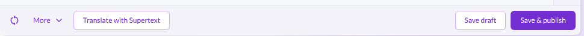
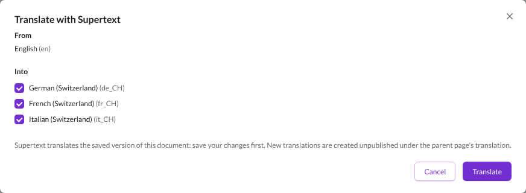
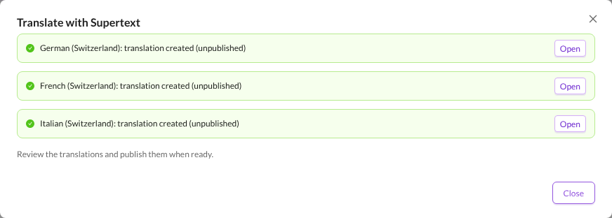
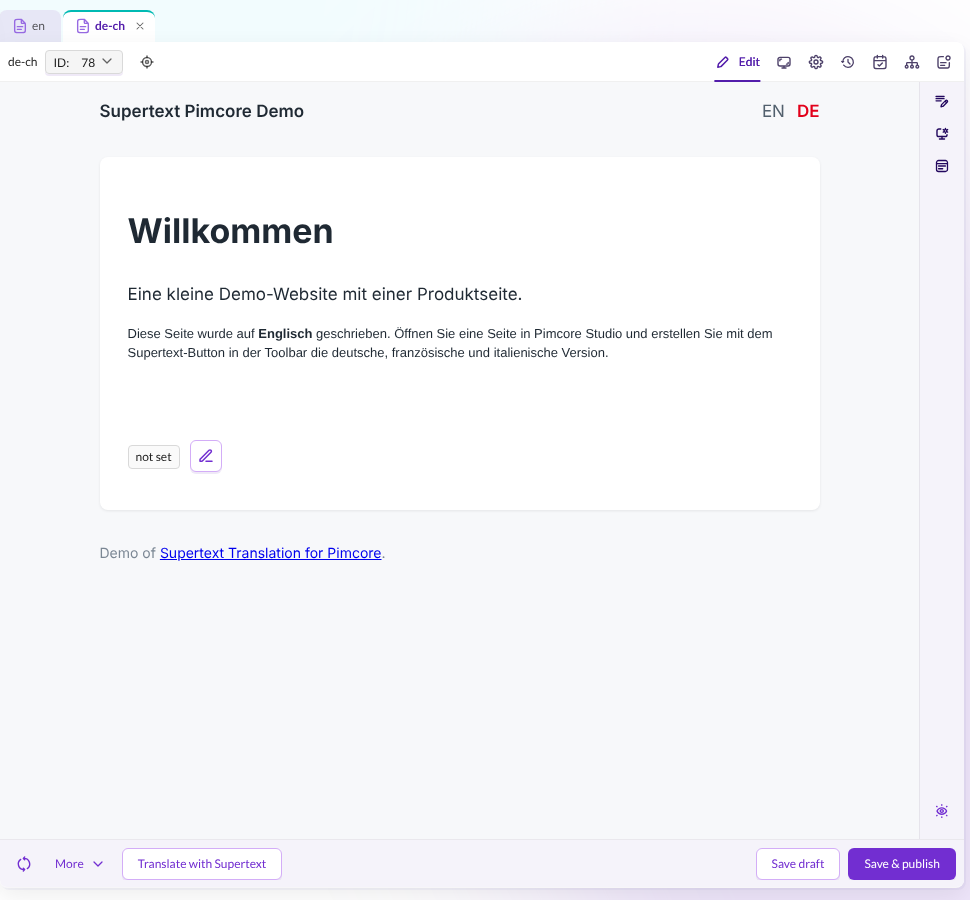
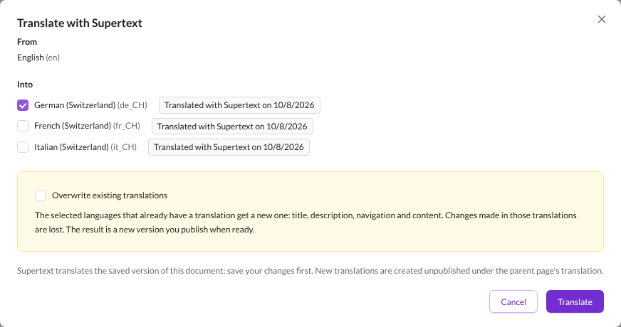
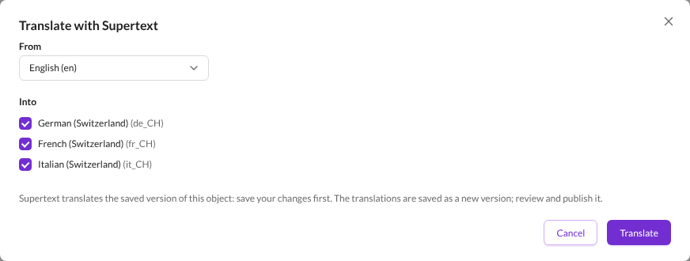
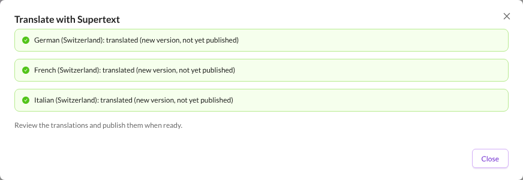
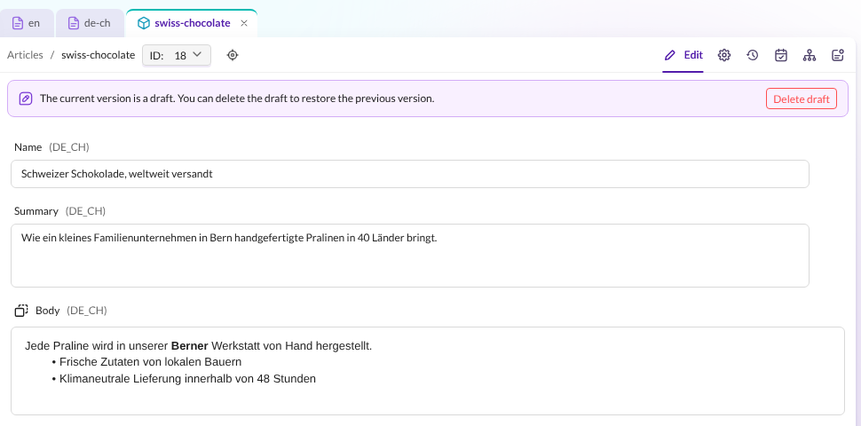

# User guide — Supertext Translation for Pimcore

For editors who translate documents and data objects in Pimcore Studio. Your administrator has installed the bundle, set up the languages and given you the permission *Translate with Supertext* (see the [installation guide](INSTALLATION.md)).

## Translate a page

1. Open the page in the language you translate **from** (e.g. in the `en` tree) and save your changes. Supertext translates the saved version.
2. Click **Translate with Supertext** in the bottom toolbar.

   

3. The dialog shows the page's language under **From**. Under **Into**, the languages without a translation of this page are ticked.

   

4. Click **Translate**. Each language takes a few seconds. The dialog then reports the result per language:

   

A new translation is created as an **unpublished** copy of the page in the target language's tree, under the parent page's translation, and linked to the original as its translation. **Open** shows it.

Translate the pages from the top down: a page can only be translated into a language once its parent page exists in that language (the dialog shows *Translate the parent page first* otherwise). Pages at the top of a language tree, like `/en`, are created directly under *Home*, e.g. as `/de-ch`.

## Review and publish

The translation contains the translated title, description, navigation name and title, and the page's texts. Formatting such as bold text, links and lists stays in place.

Change what you like, as if you had translated by hand, then **Save & publish**. Until you publish, visitors don't see the translation.

## Translate again or update a translation

Languages that already have a translation of the page show **Already translated**, or **Translated with Supertext on** *date* if Supertext made it, and are not ticked. If you tick one, the dialog shows an extra option:

- Leave **Overwrite existing translations** off: those languages are skipped (*already translated, skipped*); only missing languages are created. Your edits are safe.
- Turn it on: the existing translations get a new translation of the title, description, navigation and texts. **Changes made in those translations are lost.** The page's key (URL) stays as it is. The result is saved as a new version; the published version stays online until you publish.

## Translate a data object

Data objects (e.g. products or articles) keep all languages in one object, in their localized fields.

1. Open the object and save your changes.
2. Click **Translate with Supertext** in the bottom toolbar.
3. Choose the language to translate **from** (languages that have text). Under **Into**, the languages without text are ticked.

   

4. Click **Translate**.

   

The translations are saved as a **new version** of the object (a draft): when you close the dialog, the editor shows it. Switch the language at the bottom of the editor to check each one:

Then **Save & publish**. Languages that already have text are skipped unless you tick them and turn on **Overwrite existing translations**; then all their translatable fields are replaced.

## What is translated

| Content | What happens |
| --- | --- |
| Page title and description (SEO) | Translated |
| Navigation name and title (properties) | Translated |
| Texts: input, textarea, WYSIWYG | Translated; in WYSIWYG, headings, bold, italic, links and lists stay in place, link addresses are kept |
| Links | The link text is translated; the link target is kept |
| Page key (URL) | New translations: made from the translated navigation name or title; kept when overwriting |
| Images, snippets, relations, other editables and settings | Not translated (copied from the original when a translation is created) |
| Data objects: localized input, textarea and WYSIWYG fields | Translated |
| Data objects: other fields, field collections, object bricks, blocks | Not translated |

Empty fields are skipped. Your administrator can change which field and editable types are translated.

## History

Every translation is recorded as a note of type *supertext* on the original document or object (**Notes & Events**), with the languages and who started it. The dialog uses it for *Translated with Supertext on* *date*.

## Messages

| Message | Meaning |
| --- | --- |
| *Supertext is not set up yet* | No API key on the server. Ask your administrator. |
| *already translated, skipped* | That language already had a translation or text, and *Overwrite existing translations* was off. |
| *Translate the parent page first* / *Translate the parent page into this language first.* | The parent page doesn't exist in that language yet. Translate it first. |
| *Not allowed* / *You are not allowed to …* | You may not edit that language or create the page there. Ask your administrator. |
| *This document has no text to translate.* / *The object has no … text to translate from.* | The page or the chosen *From* language is empty. |
| *Authentication failed. Please check the Supertext API key.* | The API key is wrong. Ask your administrator. |
| *Your Supertext translation limit is exceeded.* | Your organisation's Supertext limit is used up. |
| *Too many requests to Supertext. Please try again shortly.* | Supertext was busy; try again in a moment. |
| *Timed out waiting for the Supertext translation.* / *The Supertext service is currently unavailable.* | Supertext took too long or is unavailable. Try again later. |

Errors are reported per language: if one language fails, the others are still translated.
